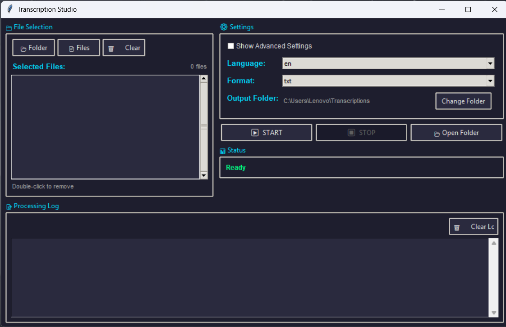

# Transcription Studio

A modern, user-friendly desktop application for transcribing video and audio files using OpenAI's Whisper AI. Convert your media files into accurate text transcripts with support for multiple languages and output formats.

## 🎯 Features

- **Batch Processing**: Transcribe multiple files at once
- **Multiple Format Support**: Works with 15+ video and audio formats
- **Language Support**: Supports multiple languages
- **Flexible Output Formats**: Export transcripts as TXT, SRT, VTT, JSON, or TSV
- **Modern GUI**: Clean, dark-themed interface with intuitive controls
- **Real-time Progress**: View transcription progress and logs in real-time
- **Smart Output Management**: Automatically creates output folders within your selected directory
- **Advanced Settings**: Optional advanced model selection (hidden by default to prevent system overload)
- **Process Control**: Start, stop, and monitor transcription processes

## 📋 Requirements

- **Python**: 3.12.0
- **Whisper CLI**: The application uses the `whisper` command-line tool
- **ffmpeg**: Required for processing audio/video files

## 🚀 Installation

### Step 1: Install Python

Make sure you have Python 3.12.0 installed on your system. You can download it from [python.org](https://www.python.org/downloads/release/python-3120/).

### Step 2: Install Whisper

Install OpenAI Whisper using pip:

```bash
pip install openai-whisper
```

Or install all dependencies from the requirements file:

```bash
pip install -r requirements.txt
```

### Step 3: Verify Whisper Installation

Verify that Whisper is installed correctly by running one of these commands:

```bash
whisper -h
```

Or:

```bash
python -m whisper -h
```

Both commands will display the Whisper help/usage text if Whisper is installed correctly.

If the `whisper` command is not recognized, you may need to add Python's Scripts directory to your system PATH.

### Step 3: Install ffmpeg

**ffmpeg is required** for Whisper to process audio and video files. The application will check for ffmpeg before starting transcription.

#### Windows Installation

**Option 1: Using Winget (Windows 10/11)**
```bash
winget install ffmpeg
```

**Option 2: Using Chocolatey**
```bash
choco install ffmpeg
```

**Option 3: Manual Installation**
1. Download ffmpeg from [ffmpeg.org](https://ffmpeg.org/download.html)
2. Extract the zip file to a location (e.g., `C:\ffmpeg`)
3. Add ffmpeg to your system PATH:
   - Open System Properties → Environment Variables
   - Add `C:\ffmpeg\bin` to the PATH variable
4. Restart your terminal/application
5. Verify installation: `ffmpeg -version`

#### macOS Installation

```bash
brew install ffmpeg
```

#### Linux Installation

**Debian/Ubuntu:**
```bash
sudo apt-get update
sudo apt-get install ffmpeg
```

**CentOS/RHEL:**
```bash
sudo yum install ffmpeg
```

**Verify Installation:**
```bash
ffmpeg -version
```

## 💻 Running the Application

### Method 1: Direct Python Execution

Navigate to the project directory and run:

```bash
python transcription-tool.py
```

Or on Linux/macOS:

```bash
python3 transcription-tool.py
```

### Method 2: Make it Executable (Linux/macOS)

```bash
chmod +x transcription-tool.py
./transcription-tool.py
```

## 📖 Usage Guide

### Basic Workflow

1. **Select Files or Folder**

   - Click **"📂 Folder"** to select a folder containing media files
   - Click **"📄 Files"** to select individual media files
   - Note: Once files are selected, selection buttons are disabled until you click **"🗑️ Clear"**

2. **Configure Settings**

   - **Language**: Select the language of your audio/video (default: English)
   - **Format**: Choose output format (TXT, SRT, VTT, JSON, TSV)
   - **Output Folder**: Automatically set to `transcriptions` folder within your selected directory
   - **Advanced Settings**: Check "Show Advanced Settings" to change the Whisper model (use with caution - larger models require more resources)

3. **Start Transcription**

   - Click **"▶️ START"** to begin transcription
   - Monitor progress in the Processing Log section
   - Click **"⏹️ STOP"** to stop the current transcription

4. **View Results**
   - Click **"📂 Open Folder"** to open the output directory
   - Transcripts are saved with the same name as the source file with the selected format extension

### Supported File Formats

#### Video Formats

- `.ts` - MPEG Transport Stream
- `.mp4` - MPEG-4
- `.mkv` - Matroska Video
- `.avi` - Audio Video Interleave
- `.mov` - QuickTime Movie
- `.flv` - Flash Video
- `.wmv` - Windows Media Video
- `.webm` - WebM

#### Audio Formats

- `.mp3` - MPEG Audio Layer 3
- `.wav` - Waveform Audio
- `.m4a` - MPEG-4 Audio
- `.aac` - Advanced Audio Coding
- `.flac` - Free Lossless Audio Codec
- `.ogg` - Ogg Vorbis
- `.wma` - Windows Media Audio

### Output Formats

- **TXT**: Plain text transcript (default)
- **SRT**: SubRip subtitle format with timestamps
- **VTT**: WebVTT subtitle format
- **JSON**: Structured data with timestamps and confidence scores
- **TSV**: Tab-separated values format

### Whisper Models

The application uses the **"small"** model by default, which provides a good balance between speed and accuracy. Advanced users can enable "Show Advanced Settings" to select from:

- **tiny**: Fastest, least accurate
- **base**: Fast, good for simple audio
- **small**: Balanced (default)
- **medium**: Slower, more accurate
- **large**: Slowest, most accurate (requires significant system resources)

⚠️ **Warning**: Using the "large" model may cause your system to become unresponsive or crash if you don't have sufficient RAM and processing power.

### Interface Features

- **File List**: Double-click any file in the list to remove it
- **Clear Logs**: Use the "🗑️ Clear Logs" button to clear the processing log
- **Status Display**: Shows current status (Ready, Processing, Completed, Stopped, etc.)
- **Real-time Logging**: All Whisper output is displayed in real-time in the Processing Log

## 🔧 Troubleshooting

### Whisper Command Not Found

If you get an error that `whisper` command is not found:

1. Make sure Whisper is installed: `pip install openai-whisper`
2. Verify Python Scripts directory is in your PATH
3. Try using the full path to the whisper executable

### System Becomes Unresponsive

- The application uses the "small" model by default to prevent system overload
- If you enabled advanced settings and selected "large" model, your system may become slow
- Use the STOP button to terminate the process
- Consider using a smaller model (tiny, base, or small)

### No Files Found in Folder

- Make sure the folder contains supported media files
- Check that file extensions match the supported formats
- The application searches for both lowercase and uppercase extensions

### Output Folder Not Created

- The application automatically creates the `transcriptions` folder in your selected directory
- If you manually change the output folder, make sure you have write permissions
- Check the Processing Log for any error messages

### ffmpeg Not Found Error

If you get a `FileNotFoundError: [WinError 2] The system cannot find the file specified` error:

1. **Install ffmpeg** (see Step 3 in Installation section above)
2. **Verify ffmpeg is in PATH**: Open a new terminal and run `ffmpeg -version`
3. **Restart the application** after installing ffmpeg
4. If the error persists:
   - Make sure ffmpeg is added to your system PATH
   - Try restarting your computer
   - Check that you're using the correct ffmpeg executable for your system (32-bit vs 64-bit)

## 📝 Notes

- Transcription time depends on:

  - File length
  - Selected Whisper model
  - System performance
  - Number of files being processed

- The application processes files sequentially (one at a time) to ensure stability

- Output files are saved with the same name as the source file, with the format extension appended

- If you stop transcription mid-process, partially completed files will not be saved

## 🛠️ Technical Details

- **Framework**: Tkinter (Python's built-in GUI library)
- **Transcription Engine**: OpenAI Whisper
- **Architecture**: Multi-threaded for non-blocking UI
- **Process Management**: Subprocess handling with graceful termination

## 📸 Snapshot



## 📄 License

This project is provided as-is for personal and educational use.

## 🤝 Contributing

Feel free to submit issues, fork the repository, and create pull requests for any improvements.

## 📧 Support

For issues or questions, please check the troubleshooting section above or create an issue in the project repository.

---

**Enjoy transcribing your media files! 🎉**
